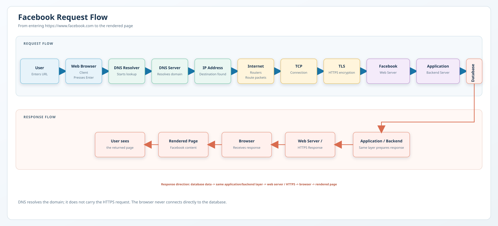

# Web Request Diagram

## Overview

This project explains what happens when a user enters `https://www.facebook.com` in a browser and presses Enter. The diagram follows the request from the user to Facebook's infrastructure and then follows the response back to the browser.

## Diagram

The editable Draw.io source is available in [facebook-request-flow.drawio](facebook-request-flow.drawio).

## Request Flow

1. The user enters `https://www.facebook.com` in the browser.
2. The browser identifies `facebook.com` as the requested domain.
3. DNS resolves the domain name to an IP address.
4. The browser establishes the required TCP connection with the destination.
5. Because Facebook uses HTTPS, the browser and server establish TLS encryption.
6. The browser sends an HTTPS request.
7. The request travels through the Internet and network routers.
8. The request reaches Facebook's web server infrastructure.
9. The application server processes the request.
10. The application may communicate with databases and other services when content is needed.
11. The server prepares an HTTPS response.
12. The response travels back through the network to the browser.
13. The browser renders the returned Facebook page and its required assets.

DNS only resolves the domain name. It does not send the HTTPS request. The browser communicates with Facebook's server-side infrastructure, while application servers communicate with databases when necessary.

## Simplified Architecture

The following is a conceptual representation of the main components:

`User -> Browser -> DNS -> IP Address -> Internet -> Facebook Web Server -> Application Server -> Database -> Application Server -> Web Server -> Browser`

The database is part of the server side; it is not accessed directly by the browser.

## Technologies / Concepts

- Web Browser
- Client
- DNS
- IP Address
- HTTP/HTTPS
- TCP
- TLS
- Internet Routing
- Web Server
- Application Server
- Database
- HTTP Response

## Purpose

The purpose of this task is to understand how a web request travels through different components before and after reaching a server.
