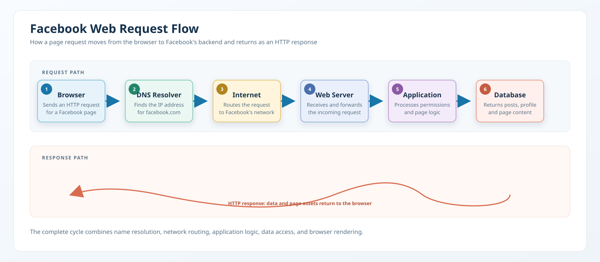

# Facebook Request Flow

This project visualizes how a browser request to Facebook travels through DNS, the network, and Facebook's backend before the page is returned.

## Example request

A user opens Facebook in a browser and requests the homepage or a profile page.

## Diagram

The diagram was created in diagrams.net (Draw.io) and exported as an SVG.

## Step-by-step explanation

1. The browser sends an HTTP request to Facebook.
2. DNS resolves facebook.com to an IP address.
3. The request travels through the internet and network infrastructure.
4. Facebook's web server receives the request and forwards it to the application server.
5. The application server processes the request and fetches the required content.
6. The database returns information such as posts, profile data, or page content.
7. The backend builds the HTTP response and sends it to the browser.
8. The browser receives the response and renders the page.

## Why this matters

This flow represents how a normal web request works in real life. Even a simple page load involves DNS, routing, server processing, application logic, and database access before the user sees the final result.

## Response example

The browser receives an HTTP response from Facebook, which contains the page content and supporting assets needed to display the website correctly.
