# Web Request Diagram

هذا المشروع يوضح رحلة طلب HTTP من المتصفح إلى موقع يستخدمه الشخص يوميًا، وهو GitHub.

## Diagram

```mermaid
graph LR
    A[المتصفح<br/>Browser] -->|1. يكتب عنوان الموقع| B[DNS Resolver]
    B -->|2. يبحث عن IP Address| C[ISP / Recursive Resolver]
    C -->|3. يرجع عنوان IP| D[Internet Routing]
    D -->|4. يرسل HTTPS Request| E[CDN / Edge Network]
    E -->|5. يوجه الطلب إلى السيرفر| F[GitHub Web Server]
    F -->|6. يطلب البيانات| G[Application Server / Backend]
    G -->|7. يقرأ البيانات| H[Database]
    H -->|8. يرجع البيانات| G
    G -->|9. يصنع الاستجابة| F
    F -->|10. يرسل HTML / JSON| E
    E -->|11. يوزع الرد على المستخدم| A
```



## شرح بسيط

عندما أفتح موقع GitHub في المتصفح، يبدأ الطلب من الجهاز الخاص بي. أول خطوة هي البحث عن عنوان IP الخاص بالموقع عبر DNS. بعد معرفة العنوان، يرسل المتصفح طلب HTTPS عبر الإنترنت. هذا الطلب يمر عبر شبكات الإنترنت، وقد يمر عبر CDN أو خوادم وسيطة قبل الوصول إلى خوادم GitHub نفسها.

بمجرد وصول الطلب إلى السيرفر، يبدأ التطبيق في تجهيز الصفحة أو البيانات المطلوبة. إذا كانت الصفحة تعتمد على بيانات من قاعدة البيانات، فسيتم طلب هذه البيانات من الواجهة الخلفية ثم من قاعدة البيانات. بعد ذلك، يرسل السيرفر الاستجابة مرة أخرى إلى المتصفح، والآخر يقوم بعرض الصفحة للمستخدم.

## لماذا هذا مهم؟

الفهم لرحلة الـ Request يساعدنا على فهم كيف تعمل الأنظمة الكبيرة في الواقع. عندما نبدأ ببناء تطبيقات حقيقية مثل منصات الفواتير أو المتاجر الإلكترونية أو أي نظام Node.js، فإن الطلب يمر بعدة مراحل للتأكد من الأمان، التحقق من الصلاحيات، قراءة البيانات، وحفظها بشكل صحيح.

## GitHub Push

```bash
git init
git add .
git commit -m "Add request flow diagram and README"
git branch -M main
git remote add origin https://github.com/your-username/web-request-diagram.git
git push -u origin main
```

استبدل `your-username` باسم المستخدم الخاص بك في GitHub، ثم قم بتشغيل الأمر الأخير لرفع المشروع.
