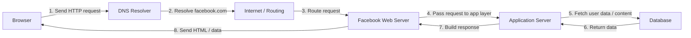

# Facebook Request Flow

This project shows how a request to Facebook is processed before the page is returned to the browser.

## Example request

A user opens Facebook in a browser and requests the homepage or a profile page.

## Diagram

## Step-by-step explanation

1. The browser sends an HTTP request to Facebook.
2. DNS resolves facebook.com to an IP address.
3. The request travels through the internet and network infrastructure.
4. Facebook receives the request on its web server.
5. The application server processes the request and fetches the required data.
6. The database returns the needed information such as posts, profile data, or page content.
7. The backend builds the final response.
8. The browser receives the page and renders it to the user.

## Why this matters

This flow represents how a normal web request works in real life. Even a simple page load involves DNS, routing, server processing, application logic, and database access before the user sees the final result.

## Response example

The browser receives an HTTP response from Facebook, which contains the page content and supporting assets needed to display the website correctly.
