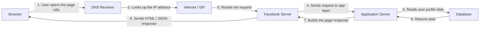

# Web Request Diagram

This project shows the path of an HTTP request when a user opens my Facebook page in the browser.

## Diagram



## Simple explanation

When I open my Facebook page in the browser, the request begins from my device. The browser asks DNS for the IP address of the Facebook domain. After the IP is found, the browser sends an HTTPS request through the internet and the request is routed to the Facebook servers.

Once the request reaches the Facebook backend, the application layer reads the required data, such as profile information, posts, or page content, from a database. The server then prepares the response and sends it back to the browser, which renders the page for the user.

## Why this matters

This request path helps explain how real web applications work in practice. Even a simple page load involves multiple steps: resolving the domain, sending the request, processing it in the backend, reading data, and returning a response to the browser.

## Note

This diagram is best created in visual tools such as Draw.io or Excalidraw, because the task is about showing the request flow clearly rather than building a live web page.

## GitHub push

```bash
git init
git add .
git commit -m "Add Facebook request diagram"
git branch -M main
git remote add origin https://github.com/your-username/web-request-diagram.git
git push -u origin main
```

Replace `your-username` with your GitHub username before pushing the project.
