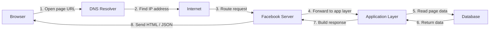

# Request Flow for a Facebook Page

This project shows how a request to a Facebook page travels through the web before the page is displayed in the browser.

## Diagram

## Explanation

When I open a Facebook page, the browser starts a request from my device. The first step is DNS, where the browser asks for the IP address of the website. After the IP is found, the browser sends an HTTPS request through the internet. That request is routed to the Facebook server.

Once the request reaches the server, the application layer processes it and fetches the data needed for the page. The database returns the required information, the server builds the final response, and the browser renders the page for the user.

## Why this matters

This request flow is the basic idea behind how web apps work. A page request does not go directly from the browser to one server. It passes through DNS, the internet, server logic, and databases before the final page is shown.

This helps me understand how real systems handle requests, fetch data, and respond to users.
