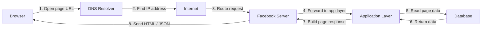

# Web Request Diagram

This project shows how a request to a Facebook page travels through the web before the page is displayed in the browser.

## Diagram

## Simple explanation

When I open my Facebook page in the browser, the request starts from my device. The browser asks DNS for the IP address of the website, then sends an HTTPS request over the internet. The request is routed to the Facebook servers, which process it and fetch the required data.

The application layer reads the needed information from the database, builds the response, and sends it back to the browser. Finally, the browser renders the page for the user.

## Why this matters

This flow explains how real web applications work. A simple page request passes through DNS, internet routing, server processing, application logic, and a database before the final response is shown to the user.
