# Web Request Diagram

This project shows the path of an HTTP request from the browser to a site I use every day: GitHub.

## Diagram

```mermaid
graph LR
    A[Browser] -->|1. User opens the URL| B[DNS Resolver]
    B -->|2. Looks up the IP address| C[ISP / Recursive Resolver]
    C -->|3. Returns the IP address| D[Internet Routing]
    D -->|4. Sends the HTTPS request| E[CDN / Edge Network]
    E -->|5. Routes the request to the server| F[GitHub Web Server]
    F -->|6. Requests data| G[Application Server / Backend]
    G -->|7. Reads data| H[Database]
    H -->|8. Returns the data| G
    G -->|9. Builds the response| F
    F -->|10. Sends HTML / JSON| E
    E -->|11. Delivers the response to the user| A
```



## Simple explanation

When I open GitHub in the browser, the request starts from my device. The first step is a DNS lookup, where the browser asks which IP address belongs to the website. After it receives the IP, the browser sends an HTTPS request over the internet. This request may pass through internet infrastructure, a CDN, or other intermediate servers before it reaches GitHub's servers.

Once the request reaches the server, the application prepares the required page or data. If the page depends on stored information, the backend requests that data from the database. After the server gathers everything needed, it sends the response back to the browser, which then renders the page for the user.

## Why this matters

Understanding the request path helps us understand how large real-world systems work. When we build more complex apps later, such as billing systems, e-commerce sites, or Node.js applications, a request passes through many layers to confirm security, validate permissions, read data, and store information correctly.

## GitHub push

```bash
git init
git add .
git commit -m "Add request flow diagram and README"
git branch -M main
git remote add origin https://github.com/your-username/web-request-diagram.git
git push -u origin main
```

Replace `your-username` with your GitHub username, then run the final command to push the project.
