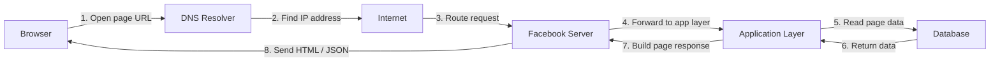

# Web Request Diagram

This project shows how a request to my Facebook page travels through the web stack before the page is displayed in the browser.

## Overview

When I open my Facebook page, the browser sends a request to the server. The request passes through several layers before the page is rendered. This diagram explains the flow step by step.

## Diagram



## Step-by-step explanation

1. The browser starts the request from my device when I open the Facebook page.
2. DNS resolves the page domain into an IP address so the client knows where to send the request.
3. The request travels through the internet and is routed to the target server.
4. The Facebook server receives the request and sends it to the application layer.
5. The application layer processes the request and fetches the required data from the database.
6. The database sends the data back to the app layer.
7. The server builds the final HTML or JSON response.
8. The browser receives that response and renders the page for the user.

## Why this matters

This flow is the foundation of how web applications work. Even a simple request passes through multiple layers: DNS, internet routing, servers, backend logic, and databases. Understanding this structure helps when building real applications in Node.js, APIs, and larger systems.

## Repository push

```bash
git init
git add .
git commit -m "Add Facebook request diagram"
git branch -M main
git remote add origin https://github.com/your-username/web-request-diagram.git
git push -u origin main
```

Replace `your-username` with your GitHub username before pushing the project.
