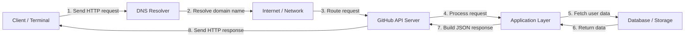

# Web Request Diagram

This project shows how a request to the GitHub API travels through the web before a response is returned.

## Example request

```bash
curl -i https://api.github.com/users/ASaber33
```

This request was executed in the terminal and returned a successful HTTP response.

## Diagram



## Step-by-step explanation

1. The client sends a request using curl to the GitHub API.
2. DNS resolves the domain name api.github.com into an IP address.
3. The request travels across the internet to the GitHub server.
4. The server receives the request and passes it to the application layer.
5. The application reads the required user data.
6. The response is prepared in JSON format.
7. The GitHub server sends the HTTP response back to the client.
8. The client receives the data and can display or process it.

## Why this matters

This flow is a real example of how web requests work in practice. Even a simple API call passes through DNS, internet routing, server processing, and response handling before the client receives the result.

## HTTP response example

The request returned a `200 OK` status, which means the server successfully processed the request and returned the requested user data.

## Repository push

```bash
git init
git add .
git commit -m "Add GitHub API request diagram"
git branch -M main
git remote add origin https://github.com/your-username/web-request-diagram.git
git push -u origin main
```

Replace `your-username` with your GitHub username before pushing the project.
